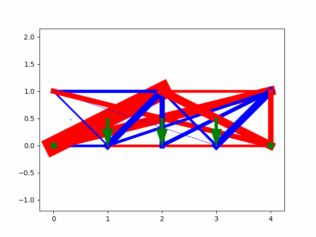
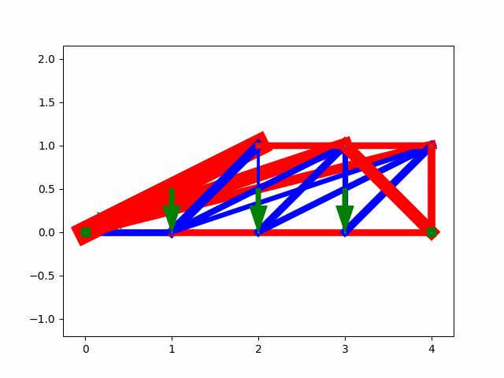
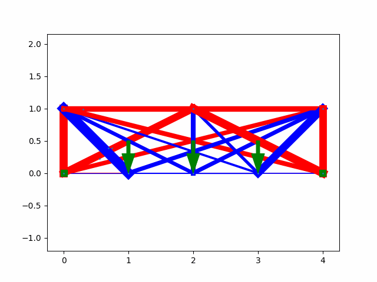
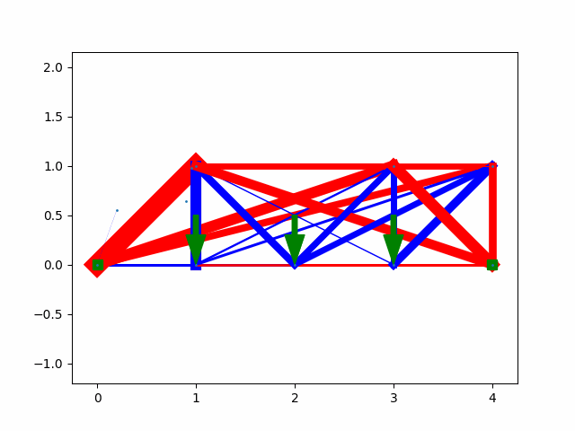
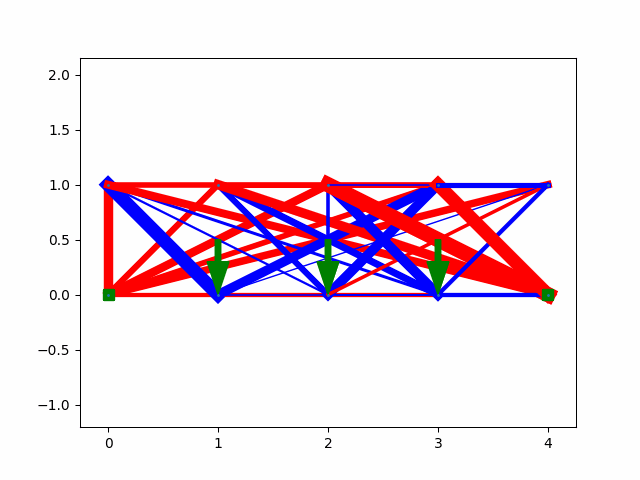
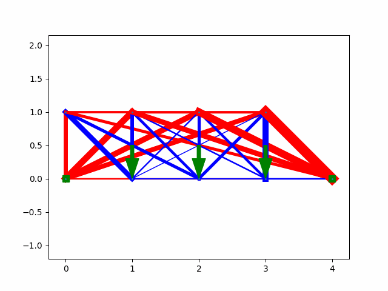
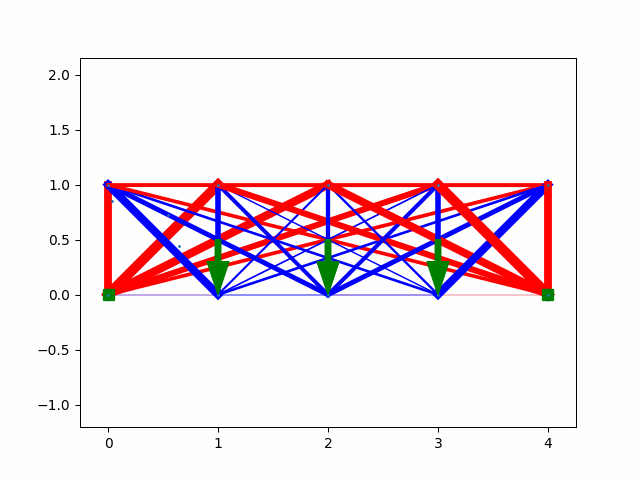

# Optimizing Every Structure, Everywhere, all at Once

This project is currently work in progress

# Ablation Studies

Initial Bridge             |   Minimizing Force | Minimizing Strain | Minimizing Strain Energy
:-------------------------:|:-------------------------:|:-------------------------:|:-------------------------:
  |   |  |  

Initial Tower             |   Minimizing Force | Minimizing Strain | Minimizing Strain Energy
:-------------------------:|:-------------------------:|:-------------------------:|:-------------------------:
  |   |  |  

# Experiments

## Branchistochrone Problem
The branchistochrone problem is the problem of finding a curve of shortest descent between two points, we assign a cost to each link as the total time it takes for a particle to travel it


# Evolution of Topologies

Generation 10             |   Generation 20 | Generation 30 | Generation 40
:-------------------------:|:-------------------------:|:-------------------------:|:-------------------------:
  |   |  |  

Population 50             |   Population 60 | Population 70 | Population 80
:-------------------------:|:-------------------------:|:-------------------------:|:-------------------------:
  |   |  |  

Total Simulation Time: 41 Hours

# To Do
- [x] Create a 3D implementation of the original proposal
- [ ] Update Installtion instructions in the README
- [ ] Plot strain energy vs iterations
- [ ] Benchmark with different frameworks and architectures
 - [ ] Implementation in C++
 - [ ] Implementation in Javascript
 - [ ] Create a project page for the project 
- [ ] Implement a learning rate scheduler for greater convergence towards the optimal structure and decrease the wobbliness
- [ ] Maybe include the stiffness matrix into force calculations for more realistic structures
- [ ] Taking inspiration from NEAT(NeuroEvolution of Augmenting Topologies) implement an evolutionary approach for creating and linking nodes to achieve a robust and optimal structure

# Experiments to Perform
- [x] Create a tower and apply two forces on the top
- [ ] Add an additional constraint for volume minimization in the loss function, current hypothesis is that when opimized with gravity the structure will resemble a honeycomb
- [x] Optimize bridges
- [ ] Create an infinite grid and simulate a hand punching in it

## Useful References
- NEAT (https://ieeexplore.ieee.org/document/6790655)
- Concise summary of NEAT (https://nn.cs.utexas.edu/downloads/papers/stanley.ec02.pdf)

## Installation

**Clone this repository:**

```bash
git clone https://github.com/darshanmakwana412/structure_optimization.git
cd structure_optimization
```

### Using Docker (Recommended):

1. **Build the Docker image:**

    Run the following command to build the Docker image:

    ```bash
    docker build -t struct_optim .
    ```

2. **Run the Docker container:**

    Execute the following command to run the Docker container:
    ```bash
    docker run --gpus all struct_optim
    ```

### Using Conda

### Using Virtual Environment
